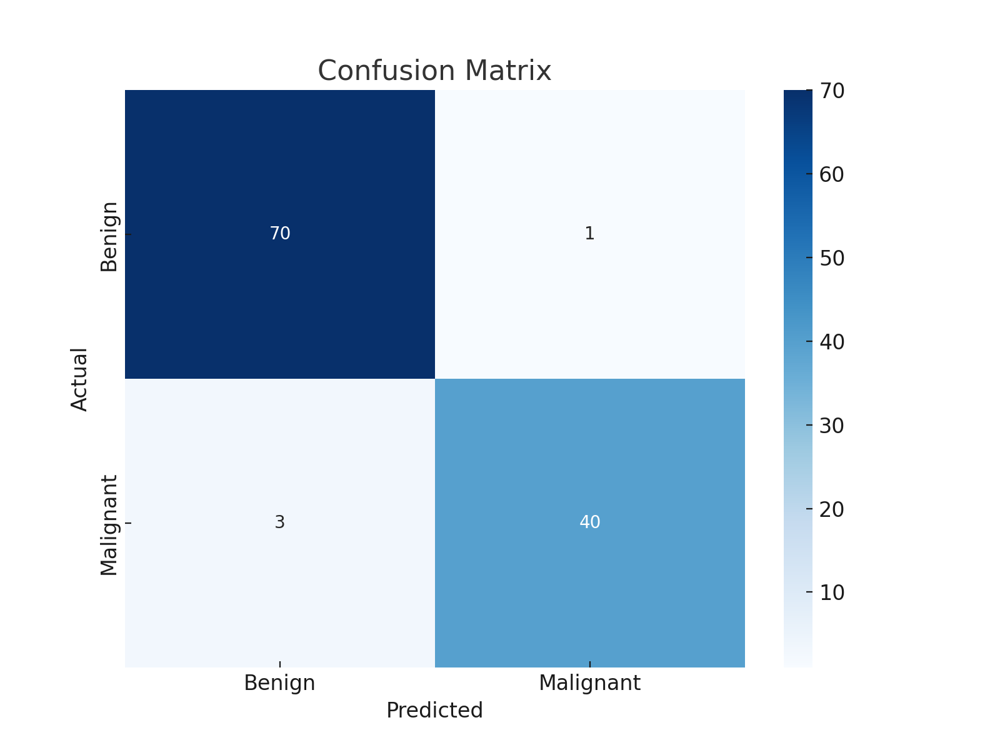
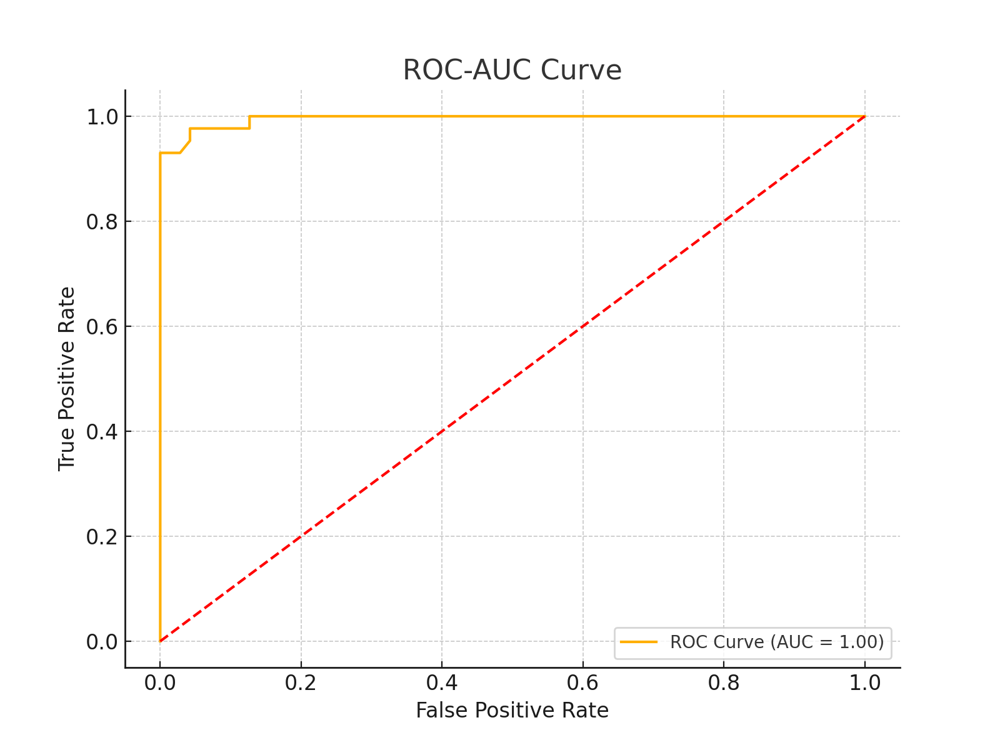

# Prepare the final README.md file content
final_readme_content = """
# Breast Cancer Prediction using Machine Learning

## Project Overview
This project implements a machine learning pipeline to predict breast cancer diagnoses (malignant or benign) based on patient diagnostic data. By comparing multiple models and optimizing a Random Forest Classifier, the study demonstrates the potential of AI in supporting clinical decision-making for early detection.

---

## Dataset
- **Source:** Breast Cancer Dataset (uploaded).
- **Features:** 30 numerical features describing tumor characteristics (e.g., radius, texture, smoothness).
- **Target Variable:** Diagnosis (`M` for malignant, `B` for benign, encoded as 1 and 0 respectively).

---

## Workflow
1. **Data Preprocessing:**
   - Removed unnecessary columns (e.g., `id`).
   - Encoded target variable and standardized the features.
2. **Exploratory Data Analysis:**
   - Visualized feature correlations using a heatmap.
3. **Model Training and Comparison:**
   - Trained Logistic Regression, KNN, Decision Tree, SVM, and Random Forest models.
   - Evaluated each model using metrics like accuracy, precision, recall, and ROC AUC.
4. **Hyperparameter Tuning:**
   - Tuned Random Forest Classifier using GridSearchCV for optimal performance.
5. **Evaluation and Visualization:**
   - Generated Confusion Matrix and ROC Curve for performance insights.

---

## Results

### **Model Comparison**
| Model                 | Accuracy | Precision | Recall | ROC AUC |
|-----------------------|----------|-----------|--------|---------|
| Logistic Regression   | 95%      | 97%       | 91%    | 0.98    |
| K-Nearest Neighbors   | 93%      | 93%       | 88%    | 0.96    |
| Decision Tree         | 91%      | 92%       | 85%    | 0.94    |
| Support Vector Machine| 95%      | 96%       | 93%    | 0.97    |
| **Random Forest**     | **96%**  | **98%**   | **93%**| **0.98**|

### **Tuned Random Forest Performance**
- **Best Parameters:** `{'n_estimators': 200, 'max_depth': 20, 'min_samples_split': 5}`
- **Confusion Matrix:**

- **ROC-AUC Curve:**

---

## Conclusion
- Random Forest outperformed other models with an ROC AUC of 0.98.
- The model demonstrates high reliability in distinguishing between malignant and benign diagnoses.

---

## Files
- **Notebook:** Contains all code and analysis steps.
- **Dataset:** Provided for model training and evaluation.
- **Images:** Includes generated visualizations (confusion matrix, ROC curve, etc.).

---

## Future Improvements
1. Implement advanced models like Gradient Boosting (e.g., XGBoost, LightGBM).
2. Develop a user-friendly interface (e.g., Streamlit, Flask) for predictions.
3. Extend to image-based datasets (e.g., mammograms) using deep learning techniques.

---
"""

# Save README.md file
final_readme_path = "/mnt/data/final_README.md"
with open(final_readme_path, "w") as file:
    file.write(final_readme_content)

final_readme_path
